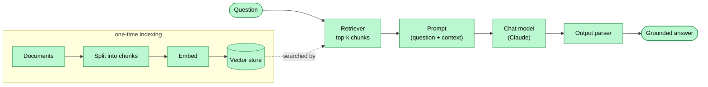
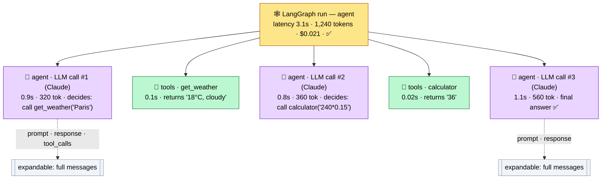
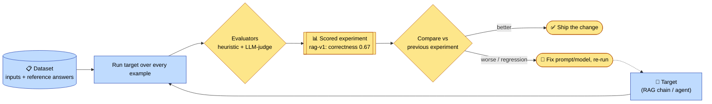

# Building LLM Applications: LangChain, LangGraph & LangSmith

These three tools are **not competitors** — they solve **three different problems** you hit, in order, as an LLM application grows up. This README is organized around those problems, not around a feature bake-off.

> The one-line story:
> - You start with a raw model API and drown in glue code → **LangChain** gives you reusable building blocks.
> - Your logic stops being a straight line — it loops, branches, and coordinates agents → **LangGraph** gives you stateful orchestration.
> - Your app is a non-deterministic black box you can't debug or measure → **LangSmith** gives you observability and evaluation.

You adopt each one *when you feel the pain it solves* — not all at once, and not because a comparison table said so.

---

## Table of Contents

1. [Problem 1: too much glue code → LangChain](#problem-1-too-much-glue-code--langchain)
2. [Full example — a RAG chain](#full-example--a-rag-chain)
3. [Problem 2: the logic isn't a straight line → LangGraph](#problem-2-the-logic-isnt-a-straight-line--langgraph)
4. [Full example — a LangGraph agent](#full-example--a-langgraph-agent)
5. [Problem 3: it's a black box you can't measure → LangSmith](#problem-3-its-a-black-box-you-cant-measure--langsmith)
6. [Full example — an evaluation dataset](#full-example--an-evaluation-dataset)
7. [How the three problems stack](#how-the-three-problems-stack)
8. [When you might reach for something else](#when-you-might-reach-for-something-else)
9. [Getting started](#getting-started)
10. [Further reading](#further-reading)

**📊 Diagrams:** [RAG data flow](#diagram-rag-data-flow) · [LangSmith trace](#diagram-what-a-trace-looks-like) · [Evaluation loop](#diagram-the-evaluation-loop) · [How they work together at runtime](#how-they-work-together-at-runtime) · [How the three problems stack](#how-the-three-problems-stack)

---

## Problem 1: too much glue code → LangChain

**The pain.** Calling a model directly (Claude, GPT, Gemini, an open model) is easy for one prompt. But a real feature needs prompt templating, output parsing, tool-calling, conversation memory, and — for anything grounded in your own data — chunking documents, embedding them, storing vectors, and retrieving the relevant ones. Written by hand, this is hundreds of lines of bespoke, provider-specific glue. Swap Claude for GPT and you rewrite half of it.

**What LangChain resolves.** It provides *standard, composable building blocks* so that glue is written once and reused:

- **Chat models** behind one interface (swap providers by changing one line).
- **Prompt templates**, **output parsers**, **tools**, and **memory**.
- The full **RAG toolkit**: document loaders, text splitters, embeddings, vector stores, and retrievers.
- **LCEL** (LangChain Expression Language) to pipe these together — `retriever | prompt | model | parser` — with streaming, batching, and async for free.

**Use it when** your control flow is essentially linear: *input → (retrieve) → prompt → model → parse → output*. That covers a huge share of real apps: chatbots, summarizers, classifiers, and retrieval-augmented Q&A.

---

## Full example — a RAG chain

A complete Retrieval-Augmented Generation pipeline: load text, split it, embed it into a vector store, retrieve relevant chunks for a question, and have the model answer **using only those chunks**.

Every request flows through the same fixed steps, once, in order — a straight line with no loops or branches:

#### Diagram: RAG data flow



```python
# pip install langchain langchain-anthropic langchain-community langchain-text-splitters faiss-cpu

from langchain_community.document_loaders import TextLoader
from langchain_text_splitters import RecursiveCharacterTextSplitter
from langchain_community.vectorstores import FAISS
from langchain_anthropic import ChatAnthropic
from langchain_community.embeddings import HuggingFaceEmbeddings  # local, no API key
from langchain_core.prompts import ChatPromptTemplate
from langchain_core.runnables import RunnablePassthrough
from langchain_core.output_parsers import StrOutputParser

# 1. LOAD your source documents
docs = TextLoader("knowledge_base.txt").load()

# 2. SPLIT into retrievable chunks (overlap keeps context across boundaries)
splitter = RecursiveCharacterTextSplitter(chunk_size=500, chunk_overlap=50)
chunks = splitter.split_documents(docs)

# 3. EMBED + STORE in a vector index
embeddings = HuggingFaceEmbeddings(model_name="sentence-transformers/all-MiniLM-L6-v2")
vectorstore = FAISS.from_documents(chunks, embeddings)
retriever = vectorstore.as_retriever(search_kwargs={"k": 4})  # top-4 relevant chunks

# 4. PROMPT that grounds the model in retrieved context
prompt = ChatPromptTemplate.from_template(
    """Answer the question using ONLY the context below.
If the answer isn't in the context, say "I don't know."

Context:
{context}

Question: {question}

Answer:"""
)

model = ChatAnthropic(model="claude-opus-4-8", temperature=0)

def format_docs(docs):
    return "\n\n".join(d.page_content for d in docs)

# 5. COMPOSE the chain with LCEL: retrieve -> prompt -> model -> parse to string
rag_chain = (
    {"context": retriever | format_docs, "question": RunnablePassthrough()}
    | prompt
    | model
    | StrOutputParser()
)

# 6. RUN
answer = rag_chain.invoke("What is our refund policy?")
print(answer)

# Streaming works out of the box:
# for token in rag_chain.stream("What is our refund policy?"):
#     print(token, end="", flush=True)
```

**Why this is a chain, not a graph:** every request flows through the same fixed steps in the same order, exactly once. There's no loop, no branching, no "try again if the answer is weak." That's precisely the sweet spot LangChain is built for — and precisely what starts to break down next.

---

## Problem 2: the logic isn't a straight line → LangGraph

**The pain.** The moment your app needs to *reason iteratively*, a chain stops fitting. A chain is a one-way pipe; it can't naturally express:

- **Loops** — "search, read, and critique yourself until the answer is good enough."
- **Branching** — "if the user is asking for a refund, take path A; otherwise path B."
- **Tool-use cycles** — an agent that calls a tool, sees the result, decides the next action, and repeats.
- **Multiple agents** — a supervisor delegating subtasks to specialists.
- **Durable state & human-in-the-loop** — pause for a human to approve a risky action, then resume; survive a crash and continue where it left off.

You *can* hack these into a chain, but the result is fragile and opaque.

**What LangGraph resolves.** It models your app as a **graph with state**:

- **Nodes** are steps (a model call, a tool, an agent) that read and update a shared **state** object.
- **Edges** — including **conditional** and **cyclic** ones — define control flow explicitly, so loops and branches are first-class and debuggable.
- A **checkpointer** persists state, giving you resumability, time-travel, and human-in-the-loop pauses for free.

Crucially, **LangGraph doesn't replace LangChain** — you use LangChain models, tools, and retrievers *inside* the nodes. LangGraph supplies the control flow; LangChain supplies the parts.

**Use it when** your app plans, loops, branches, coordinates multiple agents, or needs to pause and resume: autonomous research assistants, coding agents, multi-step support automation.

---

## Full example — a LangGraph agent

A tool-using agent that loops: the model decides whether to call a tool, the tool runs, the result feeds back to the model, and it repeats **until the model produces a final answer**. This cyclic "reason → act → observe → repeat" flow is exactly what a chain can't express.

```python
# pip install langgraph langchain-anthropic

from typing import Annotated, TypedDict
from langgraph.graph import StateGraph, START, END
from langgraph.graph.message import add_messages
from langgraph.prebuilt import ToolNode, tools_condition
from langchain_anthropic import ChatAnthropic
from langchain_core.tools import tool
from langchain_core.messages import HumanMessage

# 1. DEFINE tools the agent can call
@tool
def get_weather(city: str) -> str:
    """Get the current weather for a city."""
    fake = {"paris": "18°C, cloudy", "tokyo": "26°C, sunny"}
    return fake.get(city.lower(), "Unknown city")

@tool
def calculator(expression: str) -> str:
    """Evaluate a basic arithmetic expression, e.g. '3 * (4 + 2)'."""
    return str(eval(expression, {"__builtins__": {}}))

tools = [get_weather, calculator]

# 2. BIND tools to the model so it can emit tool calls
model = ChatAnthropic(model="claude-opus-4-8", temperature=0).bind_tools(tools)

# 3. DEFINE the shared state (a growing list of messages)
class State(TypedDict):
    messages: Annotated[list, add_messages]

# 4. NODE: the model reasons about the conversation so far
def call_model(state: State):
    return {"messages": [model.invoke(state["messages"])]}

# 5. BUILD the graph
builder = StateGraph(State)
builder.add_node("agent", call_model)
builder.add_node("tools", ToolNode(tools))   # prebuilt node that runs any requested tool

builder.add_edge(START, "agent")
# CONDITIONAL edge: if the model asked for a tool -> "tools"; else -> END
builder.add_conditional_edges("agent", tools_condition)
# THE LOOP: after tools run, go back to the agent to reason on the result
builder.add_edge("tools", "agent")

# 6. COMPILE with a checkpointer for durable, resumable state
from langgraph.checkpoint.memory import MemorySaver
graph = builder.compile(checkpointer=MemorySaver())

# 7. RUN — the agent may call several tools before answering
config = {"configurable": {"thread_id": "user-123"}}  # identifies a resumable conversation
result = graph.invoke(
    {"messages": [HumanMessage("What's the weather in Paris, and what's 15% of 240?")]},
    config,
)
print(result["messages"][-1].content)
# The agent loops: calls get_weather -> observes -> calls calculator -> observes -> final answer.

# Because state is checkpointed, a follow-up remembers the conversation:
# graph.invoke({"messages": [HumanMessage("And in Tokyo?")]}, config)
```

**What the graph buys you here:**
- **The loop** (`tools → agent`) lets the model use several tools in sequence, reacting to each result — impossible in a linear chain.
- **The conditional edge** decides *at runtime* whether to act or to answer.
- **The checkpointer** makes the conversation durable and resumable, and is what enables human-in-the-loop approvals (you can interrupt before the `tools` node, wait for a human, then resume).

> Prefer the prebuilt `create_react_agent` for a quick start; build the graph explicitly (as above) when you need custom nodes, branching, or human-in-the-loop.

---

## Problem 3: it's a black box you can't measure → LangSmith

**The pain.** LLMs are non-deterministic. When the RAG chain returns a wrong answer, *why* — bad retrieval, a weak prompt, or the model? When the agent takes a wrong turn, *which* step's state was off? And after you tweak a prompt, is quality actually **better**, or did you just fix one example and break three others? `print()` statements can't answer any of this across a multi-step, branching run.

**What LangSmith resolves.** It's an **observability and evaluation** layer:

- **Tracing** — a full, visual trace of every run: each prompt, tool call, retrieved chunk, token count, latency, and cost, nested by step. This is how you *see inside* the RAG chain and the agent loop above.
- **Evaluation** — datasets plus automated graders (LLM-as-judge, heuristics) so you can measure quality and catch **regressions** before shipping a prompt/model change.
- **Monitoring** — production dashboards, alerts on cost/latency/errors, and human-feedback collection to grow your eval sets.

It's **framework-agnostic and cross-cutting**: LangChain and LangGraph apps are traced automatically with zero code change, and any app can send traces via the SDK or OpenTelemetry.

```bash
# Turn it on — the RAG chain and agent above are now fully traced, no code edits:
export LANGSMITH_TRACING=true
export LANGSMITH_API_KEY="<your-key>"
```

#### Diagram: what a trace looks like

Running the LangGraph agent above on *"What's the weather in Paris, and what's 15% of 240?"* produces a **nested run tree** in LangSmith. Each node (span) shows latency, token usage, and cost, so you can see exactly where time and money went — and pinpoint which step misbehaved.



**Reading the trace:** the root span is the whole agent invocation; its children are each pass through the graph, in execution order — `agent (LLM) → get_weather → agent (LLM) → calculator → agent (LLM, final)`. The **three LLM calls** are the agent's reason→act→observe **loop** made visible. Clicking any span in the real UI expands the exact prompt, response, and tool arguments. If the answer were wrong, this tree tells you *immediately* whether the fault was a bad tool result, a weak prompt, or the model's reasoning.

**Use it from day one.** Tracing pays for itself the first time you debug a bad answer; evals pay for themselves the first time a "small" prompt change silently regresses quality.

---

## Full example — an evaluation dataset

Tracing tells you *what happened on one run*. **Evaluation** answers the harder question: *is the app actually good, and did my last change make it better or worse?* You build a dataset of inputs with reference answers, define graders, run your app over the whole set, and get scores you can compare across versions.

This example evaluates the **RAG chain** from earlier against a small QA dataset, using both a cheap heuristic grader and an LLM-as-judge.

```python
# pip install langsmith langchain-anthropic

from langsmith import Client, evaluate
from langchain_anthropic import ChatAnthropic

client = Client()

# 1. CREATE a dataset: question -> reference answer
dataset = client.create_dataset("refund-policy-qa", description="RAG QA eval set")
client.create_examples(
    dataset_id=dataset.id,
    examples=[
        {"inputs": {"question": "How many days do I have to return an item?"},
         "outputs": {"answer": "30 days"}},
        {"inputs": {"question": "Are shipping fees refundable?"},
         "outputs": {"answer": "No, shipping fees are non-refundable"}},
        {"inputs": {"question": "Who pays for return shipping?"},
         "outputs": {"answer": "The customer pays return shipping"}},
    ],
)

# 2. TARGET: the system under test (our RAG chain from the LangChain example)
def target(inputs: dict) -> dict:
    return {"answer": rag_chain.invoke(inputs["question"])}

# 3a. EVALUATOR — heuristic: does the answer contain the reference fact? (fast, free)
def keyword_match(outputs: dict, reference_outputs: dict) -> bool:
    return reference_outputs["answer"].lower() in outputs["answer"].lower()

# 3b. EVALUATOR — LLM-as-judge: is the answer correct given the reference? (nuanced)
judge = ChatAnthropic(model="claude-opus-4-8", temperature=0)
def llm_correctness(inputs: dict, outputs: dict, reference_outputs: dict) -> dict:
    verdict = judge.invoke(
        f"""Question: {inputs['question']}
Reference answer: {reference_outputs['answer']}
Model answer: {outputs['answer']}
Is the model answer correct and grounded in the reference? Reply only 'true' or 'false'."""
    ).content.strip().lower()
    return {"key": "correctness", "score": verdict.startswith("true")}

# 4. RUN — scores land in LangSmith, per-example and aggregated
results = evaluate(
    target,
    data="refund-policy-qa",
    evaluators=[keyword_match, llm_correctness],
    experiment_prefix="rag-v1",   # name this experiment/version
)
```

### Diagram: the evaluation loop



**The workflow this unlocks — regression testing for prompts.** Run `rag-v1` to get a baseline (say correctness 0.67). Change a prompt or swap the model, run again as `rag-v2`, and LangSmith shows the two experiments **side by side, per example** — so you can see at a glance whether your change genuinely improved quality or fixed one case while breaking two others. That turns "it feels better" into a measured decision, and lets you wire evals into CI to block regressions before they ship.

---

## How the three problems stack

```
Problem 3  ── "I can't see or measure what it does"     → LangSmith   (observe · evaluate · monitor)
                                                                       traces everything below, optional
Problem 2  ── "My logic loops, branches, coordinates"   → LangGraph   (stateful graphs · agents · HITL)
                                                                       uses building blocks from
Problem 1  ── "I'm drowning in glue code"               → LangChain   (models · prompts · tools · RAG)
```

### How they work together at runtime

The layers aren't just stacked — they interlock on every request. **LangGraph** drives the control flow; each of its nodes is built from **LangChain** components; and **LangSmith** wraps the whole run, recording every step. (GitHub renders the Mermaid diagram below.)

```mermaid
flowchart TB
    subgraph LS["🔍 LangSmith — traces & evaluates the entire run (cross-cutting)"]
        direction TB
        User(["User request"])

        subgraph LG["🕸️ LangGraph — stateful orchestration (the control flow)"]
            direction TB
            START((START)) --> Agent
            Agent{"Agent node<br/>reason on state"}
            Tools["Tools node<br/>run tool calls"]
            Agent -- "needs a tool" --> Tools
            Tools -- "loop back with result" --> Agent
            Agent -- "final answer" --> ENDN((END))
        end

        subgraph LC["🧱 LangChain — building blocks used inside the nodes"]
            direction LR
            Model["Chat model<br/>(Claude / GPT / …)"]
            Prompt["Prompt templates"]
            ToolDefs["Tools"]
            RAG["Retriever + vector store<br/>(RAG)"]
            Memory["Memory / parsers"]
        end

        Checkpoint[("💾 Checkpointer<br/>durable, resumable state")]

        User --> START
        Agent -. "uses" .-> Model
        Agent -. "uses" .-> Prompt
        Tools -. "uses" .-> ToolDefs
        Tools -. "uses" .-> RAG
        LG <-. "state persisted" .-> Checkpoint
        ENDN --> Answer(["Answer to user"])
    end

    LS -. "every prompt, tool call,<br/>token, latency & cost recorded" .-> Dashboard[["📊 Traces · Evals · Monitoring"]]

    classDef smith fill:#fde68a,stroke:#b45309,color:#000;
    classDef graph fill:#bfdbfe,stroke:#1e40af,color:#000;
    classDef chain fill:#bbf7d0,stroke:#15803d,color:#000;
    class LS,Dashboard smith
    class LG,Agent,Tools,START,ENDN graph
    class LC,Model,Prompt,ToolDefs,RAG,Memory chain
```

**Reading the diagram:**
- A request enters the **LangGraph** flow and hits the **Agent** node, which *reasons* on the shared state.
- The agent's node is powered by **LangChain** blocks — a chat model and prompt templates (dotted "uses" arrows). If it needs to act, the **Tools** node runs LangChain tools (including a RAG retriever).
- The **loop** (`Tools → Agent`) repeats reason → act → observe until the agent emits a final answer — the thing a plain chain can't do.
- The **checkpointer** persists state so the run is resumable and human-in-the-loop-ready.
- Enclosing it all, **LangSmith** records every prompt, tool call, token, latency, and cost — turning the black box into something you can debug and measure.

> For a **pure RAG chain** (no agent), drop the LangGraph box entirely: the request flows straight through LangChain blocks (`retriever → prompt → model → parser`), still wrapped by LangSmith. That's the "adopt any subset" point made visual.

They're **independent layers** — adopt any subset. A simple RAG bot may only ever need LangChain (+ LangSmith to watch it). An autonomous agent needs all three. The right question is never "which one wins," it's **"which problem am I currently having?"**

---

## When you might reach for something else

These tools aren't the only answer to each problem — useful to know the neighbors, again framed by problem:

- **Problem 1 (building blocks / RAG):** **LlamaIndex** and **Haystack** are strong data/RAG-first alternatives; **Semantic Kernel** suits .NET/enterprise; **Vercel AI SDK** is excellent for TypeScript web apps; **Pydantic AI** for type-safe Python.
- **Problem 2 (orchestration / agents):** **CrewAI** (role-based, higher-level, faster to start), **Microsoft AutoGen** (conversational multi-agent), **LlamaIndex Workflows** (event-driven), **OpenAI Agents SDK** (lightweight handoffs). LangGraph trades a bit of upfront verbosity for the most control over state and flow.
- **Problem 3 (observability / eval):** **Langfuse** and **Arize Phoenix** are popular open-source, self-hostable alternatives; **Helicone** (proxy-based), **Braintrust** (eval-first), **W&B Weave**; many interoperate via **OpenTelemetry**.

Teams routinely **mix** across problems — e.g. LlamaIndex retrieval inside a LangGraph agent, traced by Langfuse. Pick per problem, not per brand.

---

## Getting started

```bash
# Python
pip install langchain langchain-anthropic langchain-community langgraph langsmith

# JavaScript / TypeScript
npm install langchain @langchain/anthropic @langchain/langgraph langsmith
```

```bash
export ANTHROPIC_API_KEY="<your-key>"
export LANGSMITH_TRACING=true          # auto-traces LangChain & LangGraph
export LANGSMITH_API_KEY="<your-key>"
```

**Suggested path (each step is triggered by a real problem):**
1. Hit glue-code pain → build the **RAG chain** above with LangChain.
2. Can't debug a bad answer → turn on **LangSmith** and read the trace.
3. Need iterative reasoning/tools → convert it into the **LangGraph agent** above.
4. Afraid a prompt change will regress → add a **LangSmith eval dataset**.

---

## Further reading

- LangChain docs — https://python.langchain.com / https://js.langchain.com
- LangGraph docs — https://langchain-ai.github.io/langgraph/
- LangSmith docs — https://docs.smith.langchain.com

---

*This ecosystem moves fast — agent APIs and package names shift between versions. Always confirm exact syntax against the current official docs.*