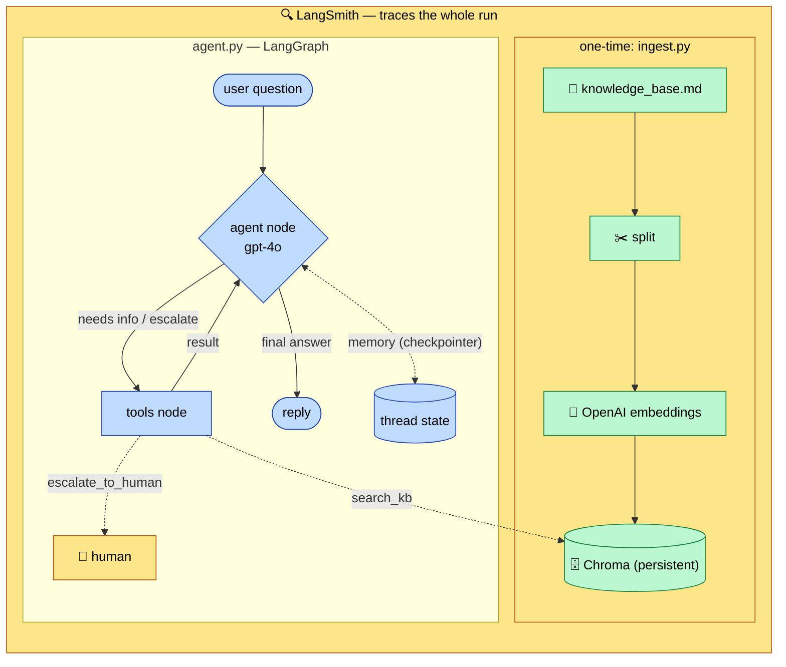

# Support Agent — full-stack example

A runnable customer-support agent that ties the whole stack together:

| Layer | Used for |
|-------|----------|
| **LangGraph** | the stateful agent loop (`agent ⇄ tools`) + conversation memory |
| **OpenAI** | `gpt-4o` for reasoning, `text-embedding-3-small` for retrieval |
| **Chroma** | the persistent **vector database** holding the knowledge base |
| **RAG** | the `search_kb` tool retrieves grounding context on demand |
| **LangSmith** | automatic tracing of every step when enabled |
| **LangChain** | the components (models, embeddings, tools, splitters) underneath |

The agent answers support questions **grounded in a knowledge base** and **escalates** to a human when the KB can't help or the request is sensitive.

## Architecture



## Files

| File | Responsibility |
|------|----------------|
| `config.py` | Shared settings (paths, model names), overridable via env vars |
| `ingest.py` | Load KB → split → embed (OpenAI) → store in Chroma. **Run once.** |
| `agent.py` | The LangGraph agent: `search_kb` (RAG) + `escalate_to_human` tools, memory, LangSmith tracing |
| `data/knowledge_base.md` | Sample support KB (returns, shipping, orders, accounts, payments) |

## Run it

```bash
pip install -r requirements.txt
cp .env.example .env            # add your OPENAI_API_KEY (and LangSmith keys)

python ingest.py               # build the Chroma vector store (once)
python agent.py                # ask the demo questions
```

`agent.py` runs two demo turns on one thread: a grounded policy question (the agent calls `search_kb`) and a sensitive $2000 refund (the agent calls `escalate_to_human`). Swap in your own questions via `ask("...")`.

## How it works

1. **Ingest** embeds the knowledge base into Chroma once, persisted to `./chroma_db`.
2. On each question, the **agent node** (gpt-4o) decides whether to answer directly or call a tool.
3. `search_kb` runs a **similarity search** over Chroma and returns grounding passages; the loop feeds them back to the agent (**RAG**).
4. Sensitive or unanswerable requests trigger `escalate_to_human` instead of a guess.
5. A **checkpointer** persists the thread, so follow-up turns keep context.
6. With `LANGSMITH_TRACING=true`, every model call, tool call, and retrieval shows up as a **trace** in LangSmith.

## Related

- [Vector Databases guide](../../vector-databases.md) — swap Chroma for Qdrant / Pinecone / pgvector
- [Agentic pattern experiments](../../experiments/) — smaller single-technique scaffolds
- [LangChain / LangGraph / LangSmith guide](../../README.md)
